# Lab 1 Report

Hope this report will find you in a good mood!

---

## Contents
- [Running Docker Compose](#running-docker-compose)
- [Running Client](#running-client)
- [Links](#links)
- [Conclusion](#conclusion)

---

## Running Docker Compose

To run the project with Docker Compose:

```bash
docker-compose build     
```

And

```bash
docker-compose up
```

As I understood from the [tutorial](https://docs.docker.com/get-started/introduction/develop-with-containers/) there are better ways to put it in docker, but for now I think it's ok (it's my first experience with docker, so sorry)

This commands will:

1. Build the Docker image for the HTTP server.
2. Start the container on port **8080**.
3. Allow you to access it at [http://localhost:8080](http://localhost:8080).

If you want to stop it:

```bash
docker compose down
```

Bellow will be some screenshots:

Running commands
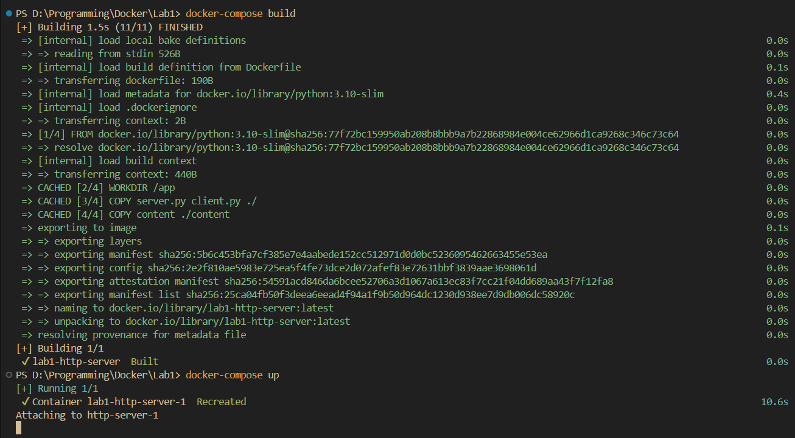

How it looks in docker
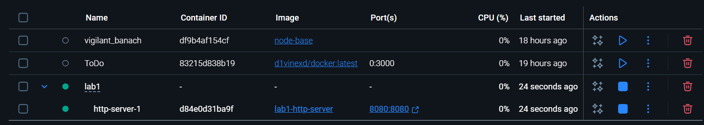
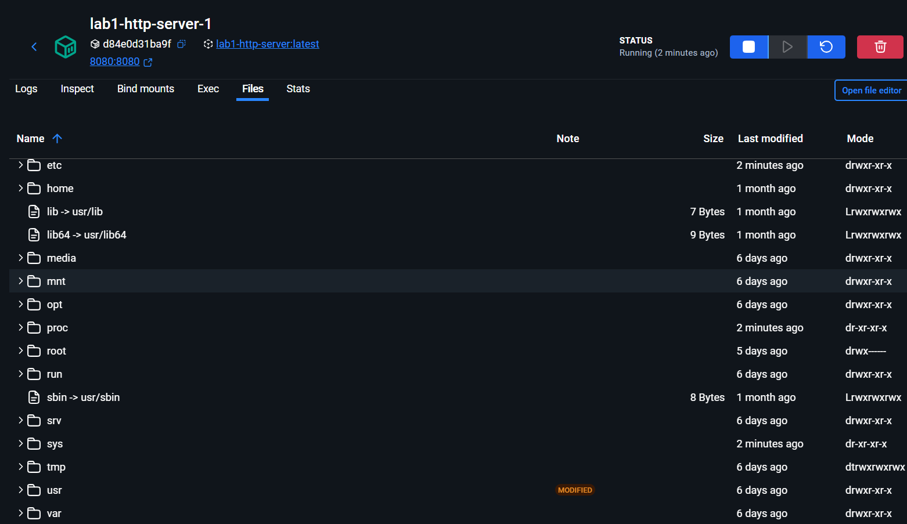

And how it looks in browser (ugly)
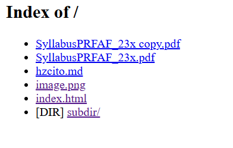

It:
- Works with nested directories:
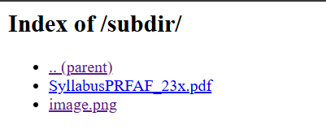
- Can go back
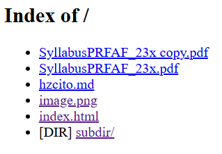
- Can open a PDF
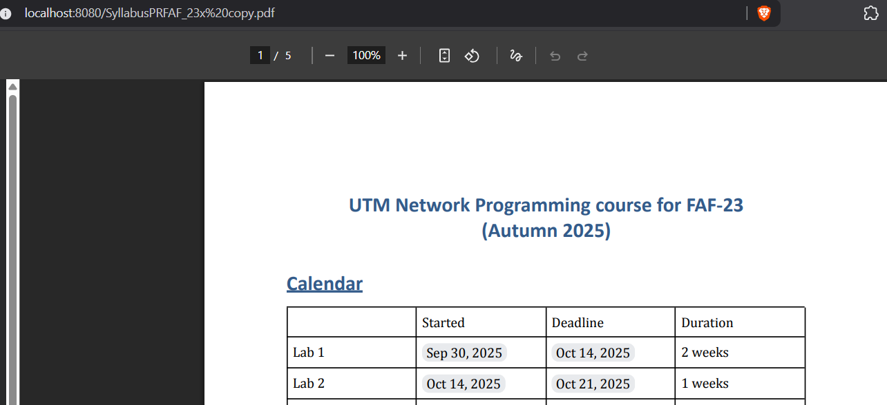
- Can open a PNG immage
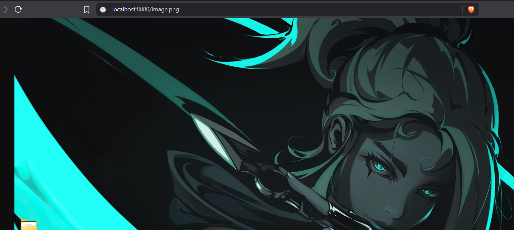
- Can open a html file
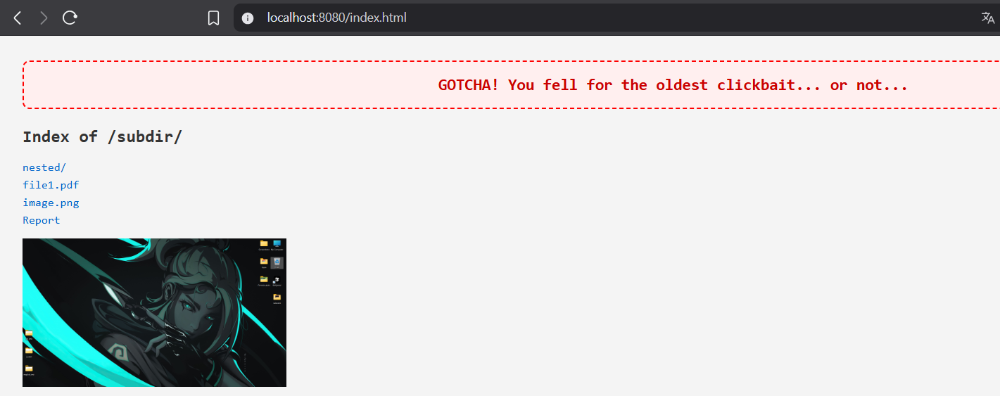
- In case of md file it will download it (I suppose if it will be txt also)
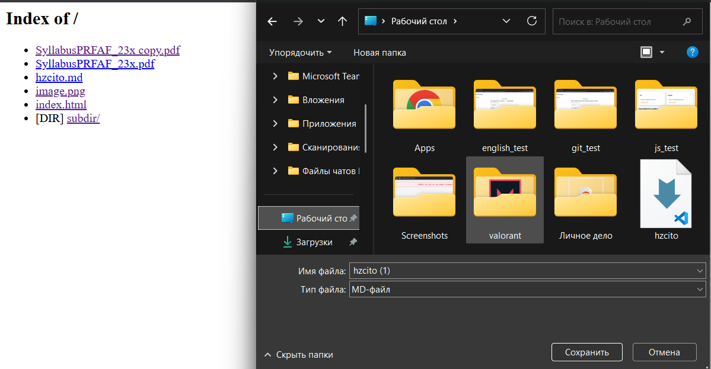

I think this is base wich handels all requirements, I will enhance it if needed.

---

## Running Client

Next is running client since it is in requirements. 

If I got it right, it should work separately from docker compose, therefore I will run it in vs code.

Also, in theory it should be ran with my friend, but all my programmer friends are drinking at xfaf or relaxing at the sea. So, we have what we have.

Firstly, we should run this command:

```bash
python client.py localhost 8080 <something>   
```

What is **something**? It is a name of the file, or image or html or... *something*...

For example:

How it looks now:
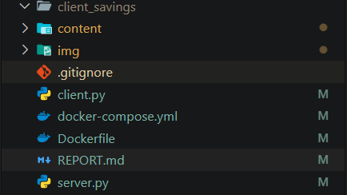

If I will run
```bash
python client.py localhost 8080 SyllabusPRFAF_23x.pdf  
```
It will show:
```bash
=== Response Headers ===
HTTP/1.1 200 OK
Content-Type: application/pdf
Content-Length: 1943426
Connection: close
=========================

Saved file: client_savings\SyllabusPRFAF_23x.pdf (1943426 bytes)
```

And will look like:
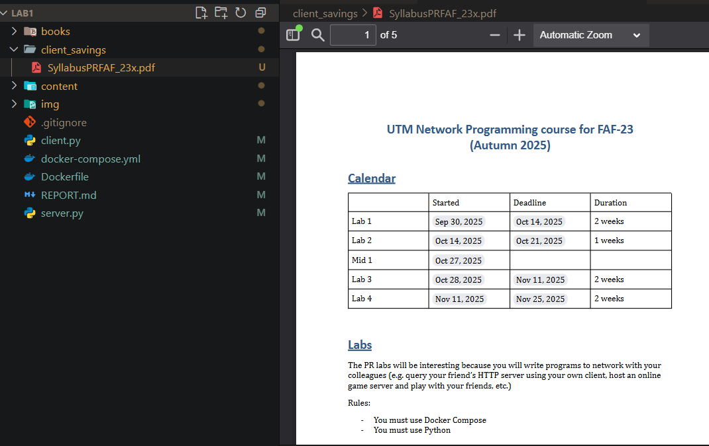

Same with image:
```bash
PS D:\Programming\Docker\Lab1> python client.py localhost 8080 image.png
=== Response Headers ===
HTTP/1.1 200 OK
Content-Type: image/png
Content-Length: 1379106
Connection: close
=========================

Saved file: client_savings\image.png (1379106 bytes)
```
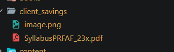

If I will make a request to html, then it will be shown:
```bash
PS D:\Programming\Docker\Lab1> python client.py localhost 8080 index.html
=== Response Headers ===
HTTP/1.1 200 OK
Content-Type: text/html
Content-Length: 1534
Connection: close
=========================

<!DOCTYPE html>
<html lang="en">
<head>
    <meta charset="UTF-8">
    <title>Directory listing for /subdir/</title>
    <style>
        body {
            font-family: monospace;
            background-color: #f4f4f4;
            color: #333;
            padding: 20px;
        }
        h2 {
            margin-top: 0;
        }
        ul {
            list-style: none;
            padding: 0;
        }
        li {
            margin: 5px 0;
        }
        a {
            color: #0066cc;
            text-decoration: none;
        }
        a:hover {
            text-decoration: underline;
        }
        .clickbait {
            background: #ffefef;
            border: 2px dashed #ff0000;
            padding: 15px;
            margin-bottom: 20px;
            font-size: 18px;
            text-align: center;
            color: #cc0000;
            font-weight: bold;
            border-radius: 8px;
            animation: shake 0.6s infinite alternate;
        }

    </style>
</head>
<body>
    <div class="clickbait">
        GOTCHA! You fell for the oldest clickbait... or not...
    </div>

    <h2>Index of /subdir/</h2>
    <ul>
        <li></li><a href="/subdir/">nested/</a></li>
        <li><a href="/subdir/Syllabus PR FAF-23x .pdf">file1.pdf</a></li>
        <li><a href="/subdir/image.png">image.png</a></li>
        <li><a href="/REPORT.md">Report</a></li>
    </ul>
    
</body>
</html>

```
---

## Links

* Server running locally: [http://localhost:8080](http://localhost:8080)
* Github repository: [https://github.com/vvtttvv/playing_with_docker_pr](https://github.com/vvtttvv/playing_with_docker_pr)
* Docker Hub: [https://hub.docker.com/repository/docker/d1vinexd/lab1pr/general](https://hub.docker.com/repository/docker/d1vinexd/lab1pr/general)
*I think docker hub can be helpful fr you, so I pushed my project there.*

---

## Conclusion
This lab was my first hands-on experience with Docker, Python sockets, and basic HTTP communication.
I managed to:

Build and run a custom HTTP server that serves files of different types (HTML, PNG, PDF, MD).

Create a Python client that can send GET requests and save responses locally.

Containerize the server using Docker and successfully run it with Docker Compose.

Test file serving and downloading both through the browser and the client.

Overall, everything works as expected — the setup is simple, functional, and forms a solid foundation for future improvements (like better error handling, logs, or UI).
It was a great introduction to deploying and interacting with services in Docker.