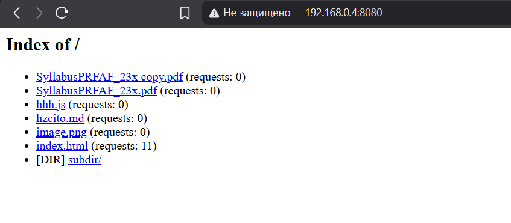
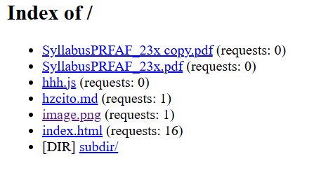
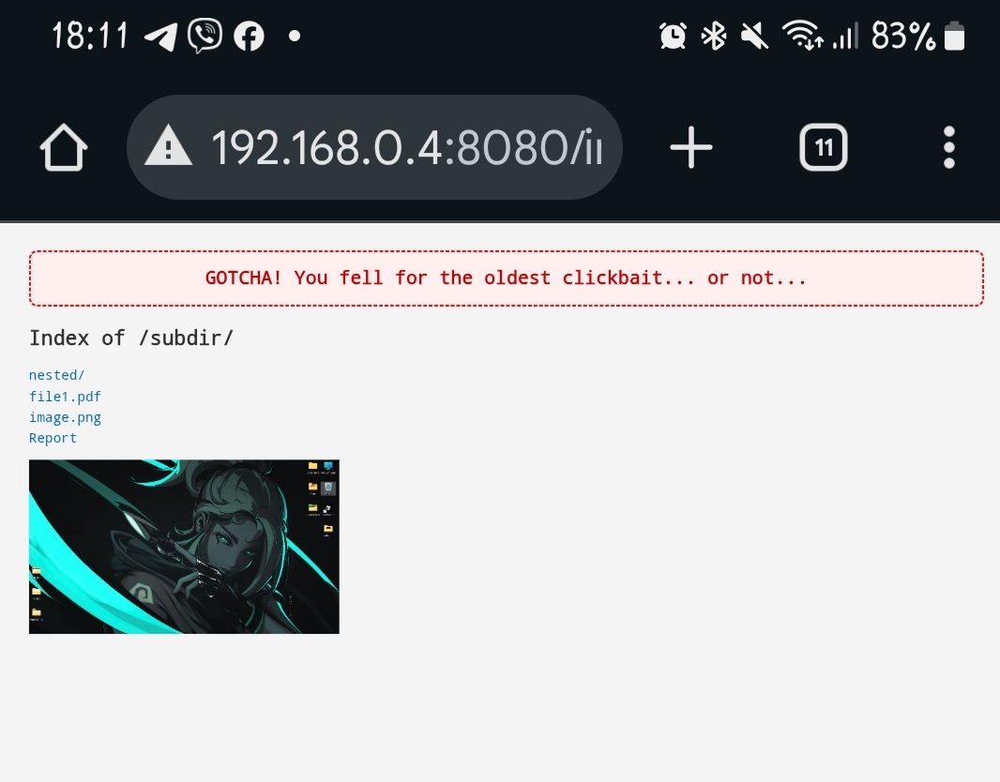

# Lab 2 Report

Hope this report will find you in a good mood!

---

## Contents
- [Running Docker Compose](#running-docker-compose)
- [Running Server](#running-server)
- [How counter looks like](#counter)
- [Running Tester](#running-tester)
- [Rate Limiting and problem with docker](#rate-limiting)
- [Links](#links)
- [Conclusion](#conclusion)

---

## Running Docker Compose

To run the project with Docker Compose:

```bash
docker-compose build     
```

And

```bash
docker-compose up
```


This commands will:

1. Build the Docker image for the HTTP server.
2. Start the container on port **8080**.
3. Allow you to access it at [http://localhost:8080](http://localhost:8080).

If you want to stop it:

```bash
docker compose down
```

---

## Running Server

I will provide this as well, because you will need it when testing race problem and rate limiting.

Command:

```bash
python server.py content
```

How it looks like:



Check in more details [how counter looks like](#counter)

---

## Counter

After some requests (alternatively run `python test_concurrent.py`) **reload** the page and you will see:



In `server.py` you have these lines in code:

```python
        # Increassing counter
        # old_value = request_counts[full_path]
        # time.sleep(0.001)
        # request_counts[full_path] = old_value + 1 
        with counts_lock:
            request_counts[full_path] += 1
```

Comment uncommented part and vise-versa. Run `python test_concurrent.py` and see that not all requests were scored, this is so called **race condition**. `Lock` helps to avoid it because is takes a thread, stops others (as I understood) and they can't acccess and change the counter until this thread will be done. 

---

## Running Tester

Just run

```bash
python test_concurrent.py
```

By default it makes 20 requests:

```python
URL = "http://127.0.0.1:8080/index.html"
N = 20
```

Feel free to change it.

---

## Rate Limiting

Now let talk about rate limiting.

Basically you choose limit in the beginning and later stopes other requests:

```python
...
RATE_LIMIT = 5
...
def check_rate_limit(ip):
    now = time.monotonic()
    with rate_lock:
        q = rate_limits[ip]
        while q and now - q[0] > 1:
            q.popleft() # Remove requests older than 1 second
        if len(q) >= RATE_LIMIT:
            return False
        q.append(now)
        return True
```

Nothing interesting. If I will run `python test_concurrent.py` it will show:

```bash
Testing concurrency...
Thread 5: 429
Thread 6: 429
Thread 3: 429
Thread 8: 429
Thread 9: 429
Thread 10: 429
Thread 11: 429
Thread 12: 429
Thread 14: 429
Thread 13: 429
Thread 15: 429
Thread 19: 429
Thread 17: 429
Thread 18: 429
Thread 16: 429
Thread 2: 200
Thread 0: 200
Thread 7: 200
Thread 1: 200
Thread 4: 200
```

Threads 2, 0, 7, 1, 4 were taken and delayed by one second, others were denyed.

**Docker takes the same IP!...** therefore everethyng went good until I tested it with phone. When I tried simulteniously to run `python test_concurrent.py` and access index.html from my phone I got `rate limit excedeed` message.

As I understood Docker on Windows will do it always, so to check rate limiting both on my phone and laptop I ran `server.py` and allowed in firewall `python.exe` for local hosts. It worked.

```bash
Connection from ('127.0.0.1', 29152)
Connection from ('127.0.0.1', 29153)
Connection from ('127.0.0.1', 29154)
Connection from ('127.0.0.1', 29155)
Connection from ('127.0.0.1', 29156)
Connection from ('192.168.0.2', 52868)
Connection from ('192.168.0.2', 52870)
```




---

## Links

* Server running locally: [http://localhost:8080](http://localhost:8080)
* Github repository: [https://github.com/vvtttvv/playing_with_docker_pr/tree/main/lab2](https://github.com/vvtttvv/playing_with_docker_pr/tree/main/lab2) 

---

## Conclusion

Really nice lab, I liked it. The most difficult point was to has connection from phone when my `test_concurrency.py` spamed the email. I tried to do it with docker, doesn't work, with server on my machine it worked after I changed some settings in my firewal.