# Lab 3 Report

I already don't understand nothing in this lab... The content is based on grading structure.

---

## Contents
- [The game works correctly according to all the rules (10 points)](#the-game-works-correctly-according-to-all-the-rules-10-points)
- [You have unit tests for the Board ADT covering all the rules, the tests are readable and documented (and passing) (10 points)](#you-have-unit-tests-for-the-board-adt-covering-all-the-rules-the-tests-are-readable-and-documented-and-passing-10-points)
- [You have a script that simulates multiple players making random moves with random timeouts. The goal is to check that the game never crashes (and it doesn't) (4 points)](#you-have-a-script-that-simulates-multiple-players-making-random-moves-with-random-timeouts-the-goal-is-to-check-that-the-game-never-crashes-and-it-doesnt-4-points)

**Design and documentation:**
- [You followed the required structure of the modules (especially the "commands" module) (6 points)](#you-followed-the-required-structure-of-the-modules-especially-the-commands-module-6-points)
- [Representation invariants, safety from rep exposure arguments, for every ADT (6 points)](#representation-invariants-safety-from-rep-exposure-arguments-for-every-adt-6-points)
- [Specifications for every method (function signature, preconditions, postconditions) (8 points)](#specifications-for-every-method-function-signature-preconditions-postconditions-8-points)

---

## The game works correctly according to all the rules (10 points)
Run `npm start 8080 boards/perfect.txt` and check every rule.
Let look at the rules and show examples:

- **First card**: a player tries to turn over a first card by identifying a space on the board…
    - 1-A - If there is no card there (the player identified an empty space, perhaps because the card was just removed by another player), the operation fails.

    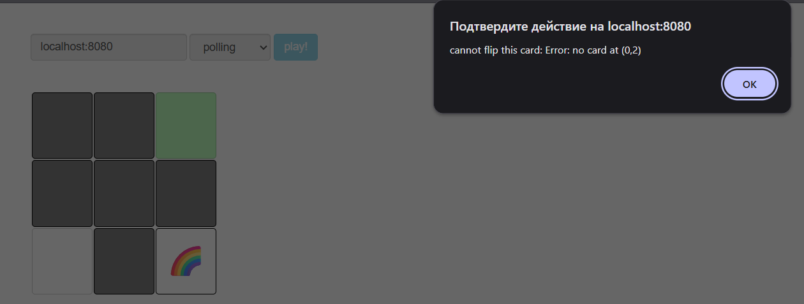

    - 1-B - If the card is face down, it turns face up (all players can now see it) and the player controls that card.


    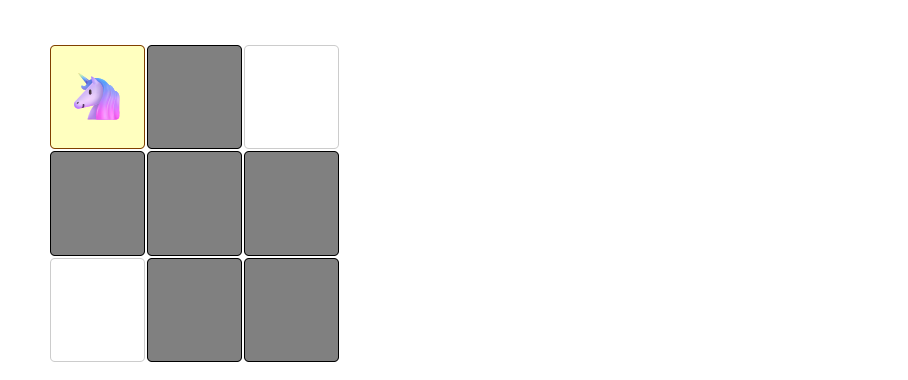

    - 1-C If the card is already face up, but not controlled by another player, then it remains face up, and the player controls the card.

    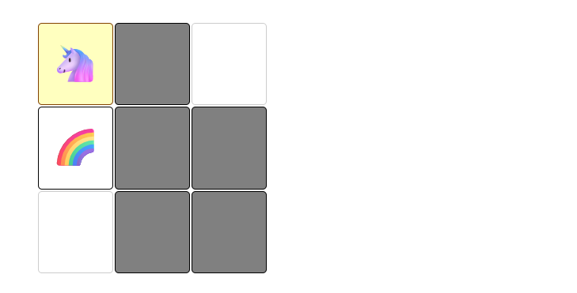

    - 1-D And if the card is face up and controlled by another player, the operation waits. The player will contend with other players to take control of the card at the next opportunity.

    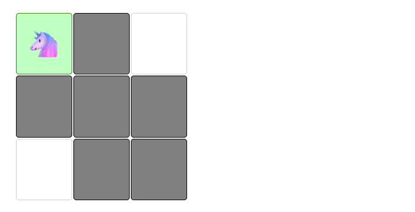

- **Second card**: once a player controls their first card, they can try to turn over a second card…
    - 2-A - If there is no card there, the operation fails. The player also relinquishes control of their first card (but it remains face up for now).

    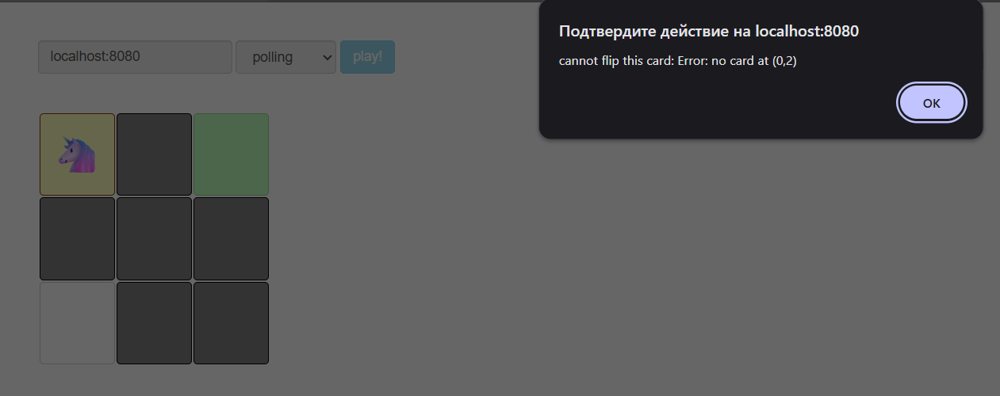

    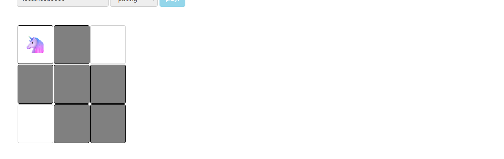

    - 2-B - If the card is face up and controlled by a player (another player or themselves), the operation fails. To avoid deadlocks, the operation does not wait. The player also relinquishes control of their first card (but it remains face up for now).

    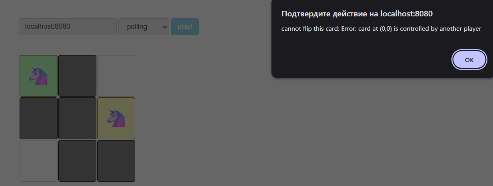

    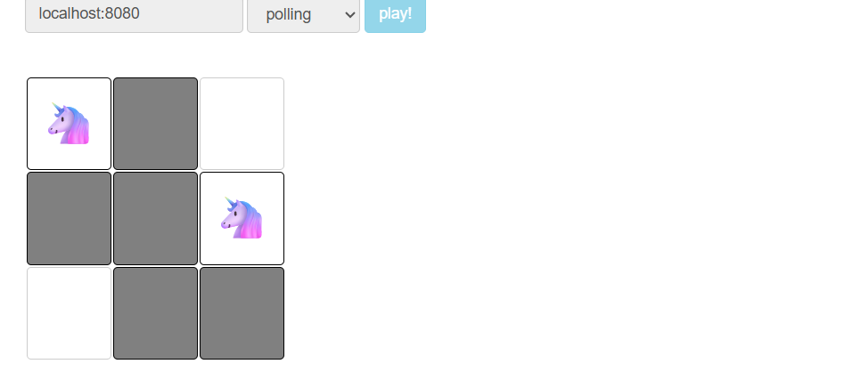

    - — If the card is face down, or if the card is face up but not controlled by a player, then:
        - 2-C - If it is face down, it turns face up.

        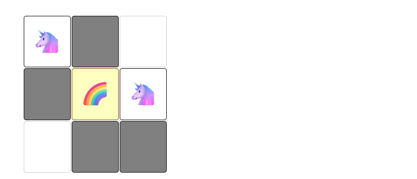

        - 2-D - If the two cards are the same, that’s a successful match! The player keeps control of both cards (and they remain face up on the board for now).

        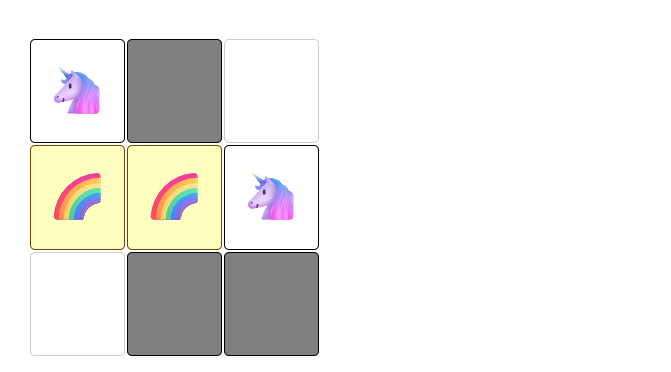

        - 2-E - If they are not the same, the player relinquishes control of both cards (again, they remain face up for now). 

        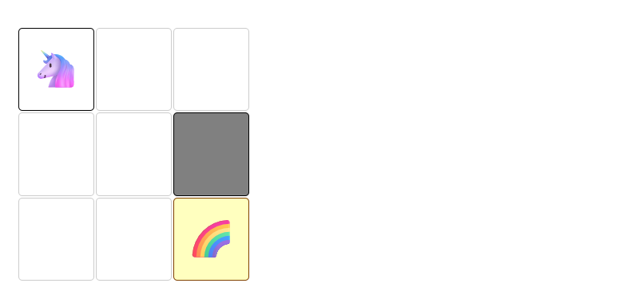

        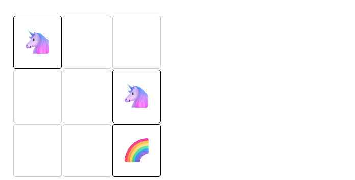

- **End of the round** 
    - 3-A If they had turned over a matching pair, they control both cards. Now, those cards are removed from the board, and they relinquish control of them. Score-keeping is not specified as part of the game.

    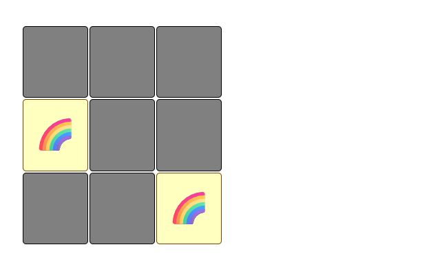

    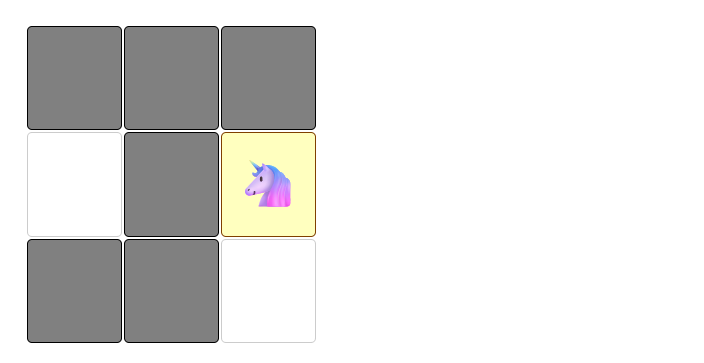

    - 3-B Otherwise, they had turned over one or two non-matching cards, and relinquished control but left them face up on the board. Now, for each of those card(s), if the card is still on the board, currently face up, and currently not controlled by another player, the card is turned face down.

    

    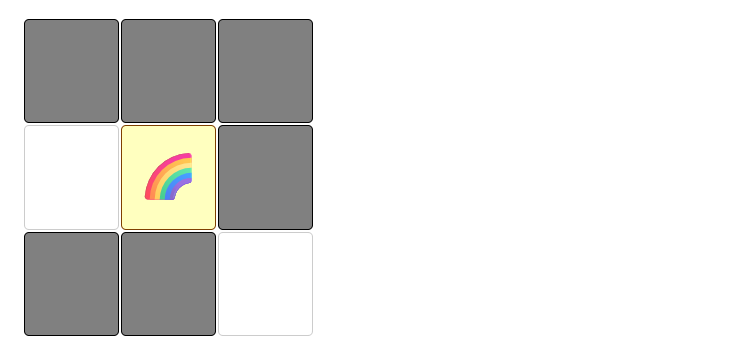

Therefore all rules are followed (*or I did not find the bug*).

## You have unit tests for the Board ADT covering all the rules, the tests are readable and documented (and passing) (10 points)

Working with node.js I encountered only mocha, therefore I used it.
Basically all tests are in `/test/board.test.ts`
And here is the putput:

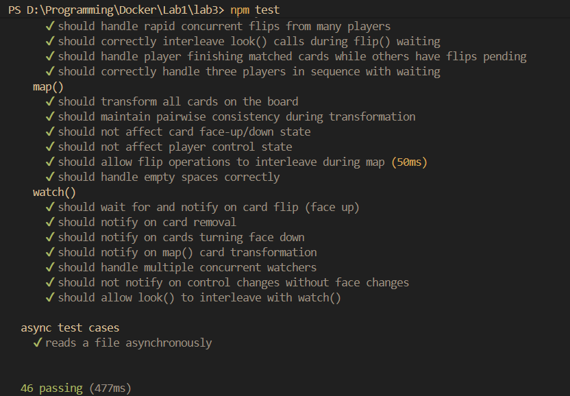


## You have a script that simulates multiple players making random moves with random timeouts. The goal is to check that the game never crashes (and it doesn't) (4 points)

In general you can see that browser supports multiplaying, but also there is `simulation.ts`

Run `npm run simulation`, you will see a long text, here I provide the end of it:

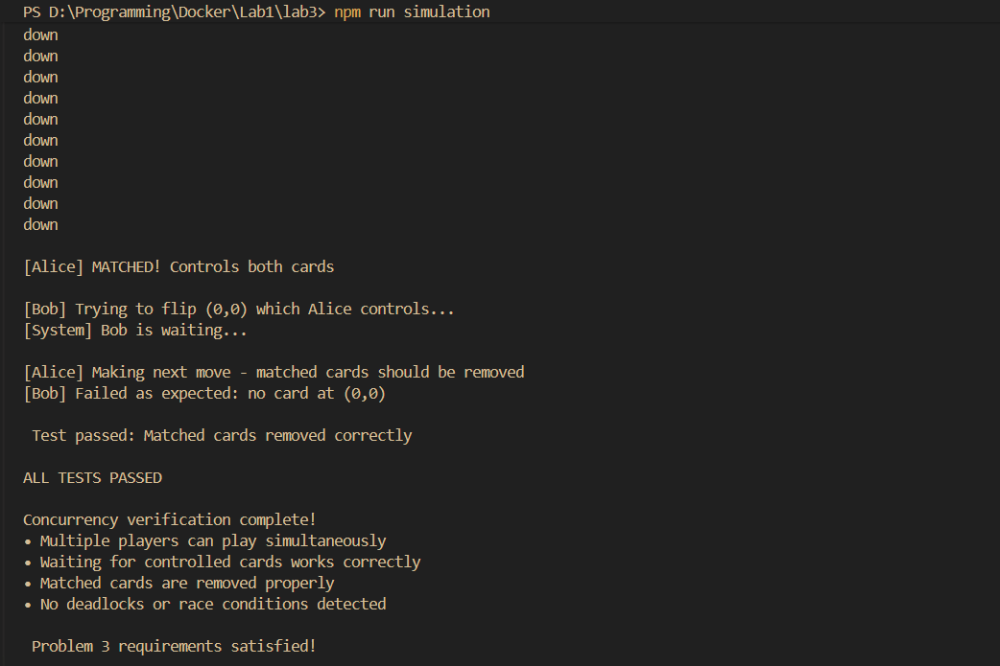


## You followed the required structure of the modules (especially the "commands" module) (6 points)

Here I will provide some points why i think I implemented this part:

1. **All Functions Are Simple Glue Code** - Each function in commands.ts is extremely simple and serves only as a thin wrapper between the HTTP server and the Board ADT, exactly as required.
2. **Functions Are 3 Lines or Less** - Each function body contains at most 3 lines, meeting the strict requirement:
`look() function`:
```ts
typescriptexport async function look(board: Board, playerId: string): Promise<string> {
  return board.look(playerId);
}
```

`flip() function`:
```ts
typescriptexport async function flip(
  board: Board,
  playerId: string,
  row: number,
  column: number
): Promise<string> {
  await board.flip(playerId, row, column);
  return board.look(playerId);
}
```

`map() function`:
```ts
typescriptexport async function map(
  board: Board,
  playerId: string,
  f: (card: string) => Promise<string>
): Promise<string> {
  await board.map(f);
  return board.look(playerId);
}
```

`watch() function`:
```ts
typescriptexport async function watch(board: Board, playerId: string): Promise<string> {
  await board.watchForChange();
  return board.look(playerId);
}
```

3. **No Complex Logic** - As required, there are:

- No if statements - no conditional logic
- No while loops - no iteration
- No string processing - no parsing or manipulation
- No game logic - all rules are in Board ADT
4. **All Logic Delegated to Board ADT** - Every command delegates all game logic to the Board ADT methods:

- board.look() - handles board state formatting
- board.flip() - handles all flip logic and rules
- board.map() - handles card transformation
- board.watchForChange() - handles change detection

This means the Board ADT is properly designed with powerful operations, and commands.ts doesn't need its own test suite.

5. **Follows Required Function Signatures** - All functions match the exact specifications provided in the assignment without any modifications to names, parameters, or return types.

## Representation invariants, safety from rep exposure arguments, for every ADT (6 points)

Basically I tried to do it everywhere where possyble, also I inspected with AI if I did it properly, I suppose this part is pretty nice to show as example:

```ts
export class Board {
  rows;
  cols;
  grid; // grid[row][col]
  players; // player ID -> state
  waitQueue; // position key -> waiting resolvers

  // Abstraction function:
  //   AF(rows, cols, grid, players, waitQueue) = a Memory Scramble game board
  //     with dimensions rows x cols, where grid[r][c] represents the space
  //     at row r, column c. Each space either has a card (face up or down)
  //     or is empty. players maps player IDs to their current game state
  //     (which cards they control and whether they matched). waitQueue
  //     tracks players waiting to control specific cards.

  // Representation invariant:
  //   - rows > 0, cols > 0
  //   - grid.length == rows
  //   - for all r in [0, rows): grid[r].length == cols
  //   - for all spaces: if card is null, then faceUp is false and controlledBy is null
  //   - for all spaces: if controlledBy is not null, then faceUp is true
  //   - for all players p: if p has firstCard and matched=true, that position has a card controlled by p
  //   - for all players p: if p has secondCard and matched=true, that position has a card controlled by p
  //   - for all players p: if p has firstCard/secondCard and matched=false, those cards are not controlled (rule 2-E)
  //   - no two players control the same card

  // Safety from rep exposure:
  //   - rows, cols are immutable primitives
  //   - grid is private and never returned; methods return copies or derived data
  //   - players is private; methods don't expose the map or player state objects
  //   - waitQueue is private and never exposed
  //   - all constructor parameters are copied into new objects

  /**
   * Check the representation invariant.
   * @throws Error if the rep invariant is violated
   */
  checkRep() {
    assert(this.rows > 0, "rows must be > 0");
    assert(this.cols > 0, "cols must be > 0");
    assert(this.grid.length === this.rows, "grid length must equal rows");

    // Check grid dimensions and space invariants
    for (let r = 0; r < this.rows; r++) {
      const row = this.grid[r];
      assert(row !== undefined, `grid[${r}] must be defined`);
      assert(row.length === this.cols, `grid[${r}] length must equal cols`);

      for (let c = 0; c < this.cols; c++) {
        const space = row[c];
        assert(space !== undefined, `grid[${r}][${c}] must be defined`);

        // Empty spaces must be face down and not controlled
        if (space.card === null) {
          assert(!space.faceUp, `empty space at (${r},${c}) cannot be face up`);
          assert(
            space.controlledBy === null,
            `empty space at (${r},${c}) cannot be controlled`
          );
        }

        // Controlled cards must be face up
        if (space.controlledBy !== null) {
          assert(space.faceUp, `controlled card at (${r},${c}) must be face up`);
        }
      }
    }

    // Check no two players control the same card
    const controlledPositions = new Set();
    for (let r = 0; r < this.rows; r++) {
      for (let c = 0; c < this.cols; c++) {
        const space = this.grid[r][c];
        const controllerId = space.controlledBy;
        if (controllerId !== null) {
          const key = `${r},${c}`;
          assert(
            !controlledPositions.has(key),
            `multiple players control (${r},${c})`
          );
          controlledPositions.add(key);
        }
      }
    }

    // Check player state consistency
    for (const [playerId, state] of this.players) {
      if (state.firstCard) {
        const { row, col } = state.firstCard;
        const space = this.grid[row][col];
        assert(
          space.card !== null,
          `player ${playerId} first card at (${row},${col}) is empty`
        );

        if (state.matched) {
          assert(
            space.controlledBy === playerId,
            `player ${playerId} first matched card not controlled by them`
          );
        }
      }
      // ... similar checks for secondCard
    }
  }
}
```

## Specifications for every method (function signature, preconditions, postconditions) (8 points)

Pretty much same for this part. Again I will provide an example:

```ts
/**
   * Flip a card at the given position.
   * Implements the complete game rules from PS4 handout.
   *
   * @param playerId ID of player making the flip
   * @param row row of card to flip, must be in [0, rows)
   * @param col column of card to flip, must be in [0, cols)
   * @returns promise that resolves when flip completes successfully
   * @throws Error if flip fails (no card at position, or attempting to flip
   *         a second card that's controlled by someone)
   *
   * Preconditions:
   *   - 0 <= row < this.rows
   *   - 0 <= col < this.cols
   *   - playerId is a nonempty string matching /^[a-zA-Z0-9_]+$/
   *   - this.checkRep() holds before the call
   *
   * Postconditions:
   *   - this.checkRep() holds after the call
   *   - If successful (first card): card at (row, col) is face up and controlled by playerId
   *   - If successful (second card, match): both cards remain face up and controlled by playerId
   *   - If successful (second card, no match): both cards are face up but not controlled
   *   - If previous play had matched cards: those cards are removed from board (Rule 3-A)
   *   - If previous play had non-matched cards: those cards are face down if not controlled (Rule 3-B)
   *   - If operation fails: board state unchanged except for Rule 3 cleanup
   */
  async flip(playerId, row, col) {
    assert(row >= 0 && row < this.rows, `row ${row} out of bounds`);
    assert(col >= 0 && col < this.cols, `col ${col} out of bounds`);
    // Get or create player state
    if (!this.players.has(playerId)) {
      this.players.set(playerId, {
        firstCard: null,
        secondCard: null,
        matched: false,
      });
    }
    const playerState = this.players.get(playerId);
    assert(playerState !== undefined, `Player "${playerId}" must exist`);
    const rowData = this.grid[row];
    assert(rowData !== undefined, `grid[${row}] must be defined`);
    const space = rowData[col];
    assert(space !== undefined, `grid[${row}][${col}] must be defined`);
    // Determine if this is first or second card
    const isFirstCard =
      playerState.firstCard === null || playerState.secondCard !== null;
    // RULE 3: Before flipping a new first card, finish previous play
    if (isFirstCard) {
      await this.finishPreviousPlay(playerId, playerState);
    }
    if (isFirstCard) {
      await this.flipFirstCard(playerId, playerState, row, col, space);
    } else {
      await this.flipSecondCard(playerId, playerState, row, col, space);
    }
    this.checkRep();
  }
```

## Conclusion

Nah... I do not want to present it... But it was really interesting, I think it can be a good practice to save my and others time at wor (specifically I'm talking about specifications and representation invariants).