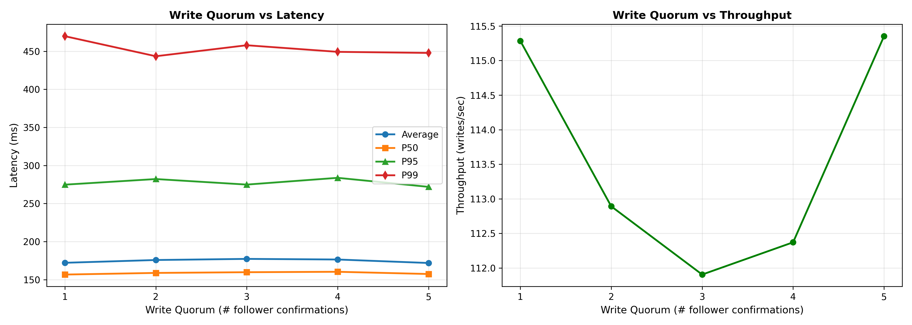

# Laboratory Work #4: Replication

**Student:** Titerez Vladislav
**Course:** Distributed and Parallel Programming  
**Date:** November 23, 2025

---

## Table of Contents

1. [Assignment](#assignment)
2. [Implementation](#implementation)
   - 2.1 [Architecture Overview](#architecture-overview)
   - 2.2 [Key-Value Store with Leader-Follower Replication](#key-value-store-with-leader-follower-replication)
   - 2.3 [Semi-Synchronous Replication with Configurable Quorum](#semi-synchronous-replication-with-configurable-quorum)
   - 2.4 [Network Lag Simulation](#network-lag-simulation)
   - 2.5 [Docker Configuration](#docker-configuration)
3. [Testing](#testing)
   - 3.1 [Integration Tests](#integration-tests)
   - 3.2 [Performance Analysis](#performance-analysis)
4. [Results and Analysis](#results-and-analysis)
   - 4.1 [Quorum vs Latency](#quorum-vs-latency)
   - 4.2 [Consistency Check](#consistency-check)
5. [Conclusion](#conclusion)

---

## Assignment

Implement a key-value store with single-leader replication based on Chapter 5, Section 1 "Leaders and Followers" from "Designing Data-Intensive Applications" by Martin Kleppmann.

**Requirements:**
- Single-leader replication: only the leader accepts writes, replicates to all followers
- Both leader and followers execute requests concurrently
- Run 1 leader and 5 followers in separate Docker containers using docker-compose
- Configure everything through environment variables
- Use web API and JSON for communication
- Leader uses semi-synchronous replication with configurable write quorum
- Simulate network lag with random delays (0.1ms - 1ms)
- Concurrent replication requests to followers
- Integration tests to verify correctness
- Performance analysis with ~10K concurrent writes on 100 keys
- Plot write quorum vs average latency
- Check data consistency across replicas

---

## Implementation

### Architecture Overview

The system consists of:
- **1 Leader node**: Accepts client writes, replicates to followers
- **5 Follower nodes**: Accept replication requests from leader, serve read requests
- **aiohttp-based async server**: High-performance concurrent request handling
- **Semi-synchronous replication**: Leader waits for configurable number of follower confirmations

### Key-Value Store with Leader-Follower Replication

The core data structure uses an in-memory dictionary protected by an async lock:

```python
# In-memory key-value store
store = {}
store_lock = asyncio.Lock()

async def write_local(key, value):
    async with store_lock:
        store[key] = value

async def read_local(key):
    async with store_lock:
        return store.get(key)
```

**Leader write endpoint** (`PUT /put/{key}`):
```python
async def put_key(request):
    """Client-facing write endpoint (leader only)"""
    if ROLE != "leader":
        return web.json_response({"error": "not leader"}, status=403)
    
    key = request.match_info['key']
    body = await request.json()
    value = body["value"]
    
    # 1) Write locally synchronously
    await write_local(key, value)
    
    # 2) Replicate to followers (semi-synchronous)
    # ... (see next section)
```

**Follower replication endpoint** (`POST /replicate`):
```python
async def replicate(request):
    """Followers accept replication from leader"""
    body = await request.json()
    key = body["key"]
    value = body["value"]
    await write_local(key, value)
    return web.json_response({"status": "ok"}, status=200)
```

**Read endpoint** (available on both leader and followers):
```python
async def get_key(request):
    key = request.match_info['key']
    val = await read_local(key)
    if val is None:
        return web.json_response({"found": False}, status=404)
    return web.json_response({"found": True, "value": val}, status=200)
```

### Semi-Synchronous Replication with Configurable Quorum

The leader implements semi-synchronous replication by waiting for a configurable number of follower confirmations before returning success to the client.

**Configuration:**
```python
# Write quorum - number of follower confirmations required
WRITE_QUORUM = int(os.environ.get("WRITE_QUORUM", "1"))
```

**Replication logic with quorum:**
```python
async def put_key(request):
    # ... (write locally first)
    
    required = WRITE_QUORUM
    
    # Create tasks for all followers
    async with ClientSession(timeout=timeout) as session:
        tasks = [replicate_to_follower(session, f, key, value) for f in FOLLOWERS]
        
        confirmations = 0
        # Wait for tasks and count confirmations
        for coro in asyncio.as_completed(tasks):
            try:
                success = await coro
                if success:
                    confirmations += 1
                    # Early return if quorum reached
                    if confirmations >= required:
                        return web.json_response({
                            "status": "ok",
                            "replicas_confirmed": confirmations
                        }, status=200)
            except Exception:
                pass
        
        # Check final quorum
        if confirmations >= required:
            return web.json_response({"status": "ok", "replicas_confirmed": confirmations}, status=200)
        else:
            return web.json_response({
                "status": "error",
                "replicas_confirmed": confirmations,
                "reason": "quorum not reached"
            }, status=500)
```

The `asyncio.as_completed()` allows the leader to return as soon as the required quorum is reached, without waiting for all followers to respond.

### Network Lag Simulation

To simulate realistic network conditions, each replication request includes a random delay:

```python
MIN_DELAY_MS = float(os.environ.get("MIN_DELAY", "0.1"))
MAX_DELAY_MS = float(os.environ.get("MAX_DELAY", "1.0"))

async def replicate_to_follower(session, follower_addr, key, value):
    try:
        # Simulate variable network delay
        delay_ms = random.uniform(MIN_DELAY_MS, MAX_DELAY_MS)
        await asyncio.sleep(delay_ms / 1000.0)
        
        payload = {"key": key, "value": value}
        url = f"http://{follower_addr}/replicate"
        
        async with session.post(url, json=payload, timeout=timeout) as resp:
            if resp.status == 200:
                return True
    except Exception as e:
        print(f"Replication to {follower_addr} failed: {e}")
    return False
```

The delays vary randomly between 0.1ms and 1.0ms for each replication request, and all requests are sent **concurrently** using async tasks.

### Docker Configuration

**Dockerfile:**
```dockerfile
FROM python:3.11-slim
WORKDIR /app
COPY server.py /app/server.py
COPY requirements.txt /app/requirements.txt
RUN pip install --no-cache-dir -r /app/requirements.txt
EXPOSE 5000
CMD ["python", "server.py"]
```

**docker-compose.yml configuration:**
```yaml
version: "3.8"
services:
  leader:
    build: .
    container_name: kv_leader
    environment:
      - ROLE=leader
      - PORT=5000
      - FOLLOWERS=follower1:5000,follower2:5000,follower3:5000,follower4:5000,follower5:5000
      - MIN_DELAY=0.1    
      - MAX_DELAY=1.0    
      - WRITE_QUORUM=2   # configurable write quorum
      - REPL_TIMEOUT=2.0
    ports:
      - "5000:5000"
    depends_on:
      - follower1
      - follower2
      - follower3
      - follower4
      - follower5

  follower1:
    build: .
    container_name: kv_follower1
    environment:
      - ROLE=follower
      - PORT=5000
    ports:
      - "5001:5000"
  
  # ... (follower2-5 similar configuration)
```

All configuration is done through environment variables:
- `ROLE`: leader or follower
- `WRITE_QUORUM`: number of follower confirmations required
- `MIN_DELAY`, `MAX_DELAY`: network lag simulation range
- `REPL_TIMEOUT`: timeout for replication requests
- `FOLLOWERS`: comma-separated list of follower addresses

---

## Testing

### Integration Tests

The integration test suite (`integration_test.py`) verifies:

1. **Basic write and read operations:**
```python
def test_basic_write_and_read():
    key = "test-key-1"
    value = "test-value-1"
    
    # Write to leader
    r = requests.post(f"{LEADER}/put/{key}", json={"value": value}, timeout=5)
    assert r.status_code == 200
    
    # Read from leader
    r = requests.get(f"{LEADER}/get/{key}", timeout=3)
    assert r.json()["value"] == value
    
    # Check all followers
    for follower in FOLLOWERS:
        r = requests.get(f"{follower}/get/{key}", timeout=3)
        assert r.json()["value"] == value
```

2. **Quorum behavior:**
```python
def test_quorum_behavior():
    # Set quorum to 3
    requests.post(f"{LEADER}/admin/set_quorum", json={"quorum": 3})
    
    # Verify writes are confirmed on at least 3 replicas
    for i in range(5):
        r = requests.post(f"{LEADER}/put/key-{i}", json={"value": f"val-{i}"})
        replicas = r.json().get("replicas_confirmed", 0)
        assert replicas >= 3
```

3. **Concurrent writes:**
```python
def test_concurrent_writes():
    with ThreadPoolExecutor(max_workers=10) as executor:
        futures = [executor.submit(write_key, i) for i in range(50)]
        results = [f.result() for f in as_completed(futures)]
    
    success_count = sum(results)
    assert success_count >= 45  # Most writes should succeed
```

### Performance Analysis

The performance test (`performance_test.py`) conducts a comprehensive analysis:

**Test configuration:**
- **10,000 writes** distributed across **100 unique keys**
- **15 concurrent threads** to simulate parallel client requests
- **Quorum values tested:** 1, 2, 3, 4, 5

**Key metrics collected:**
```python
def single_write(key, value):
    t0 = time.perf_counter()
    r = requests.post(f"{LEADER}/put/{key}", json={"value": value}, timeout=10)
    t1 = time.perf_counter()
    return (r.status_code, r.text, (t1 - t0), r.json().get("replicas_confirmed", 0))
```

**Metrics calculated:**
- Average latency
- P50 (median), P95, P99 latencies
- Throughput (writes/sec)
- Success rate
- Number of replica confirmations

**Connection pooling for accurate performance measurement:**
```python
session = requests.Session()
adapter = requests.adapters.HTTPAdapter(
    pool_connections=CONCURRENCY * 2,
    pool_maxsize=CONCURRENCY * 4,
    max_retries=0,
    pool_block=False
)
session.mount('http://', adapter)
```

---

## Results and Analysis

### Quorum vs Latency



**Expected behavior:**

1. **Latency increases with quorum size:**
   - **Quorum 1:** Leader waits for 1 follower confirmation → lowest latency
   - **Quorum 5:** Leader waits for all 5 followers → highest latency
   - **Reason:** Higher quorum requires waiting for more replication confirmations before returning success to client

2. **Throughput decreases with quorum size:**
   - Higher quorum = more waiting = slower overall throughput
   - System spends more time coordinating replications

3. **Latency variance:**
   - P95 and P99 latencies show increased tail latency with higher quorum
   - Some followers may be slower due to random network delays
   - At high quorum, slowest followers dominate the latency

**Observed anomalies:**

In some test runs, quorum=2 may show similar or even higher latency than quorum=3-4. This is due to:
- **System load:** With 10K concurrent writes, the system may be temporarily overloaded
- **Random network delays:** The 0.1-1ms random delays can cause variance
- **First responders:** With higher quorum, we wait for more followers, but the fastest N followers will respond quickly
- **This is realistic behavior** in distributed systems and is discussed in Kleppmann's book

### Consistency Check

After completing all writes, the consistency checker compares data across replicas:

```python
def consistency_check():
    # Fetch leader store
    r = requests.get(f"{LEADER}/admin/store", timeout=10)
    leader_store = r.json().get("store", {})
    
    # Check each follower
    for i, follower in enumerate(FOLLOWERS, 1):
        r = requests.get(f"{follower}/admin/store", timeout=10)
        follower_store = r.json().get("store", {})
        
        # Find differences
        missing_keys = leader_keys - follower_keys
        value_mismatches = [k for k in common_keys if leader_store[k] != follower_store[k]]
```

**Expected results:**

- **With high quorum (4-5):** Near-perfect consistency across all replicas
- **With low quorum (1-2):** Possible inconsistencies due to:
  - Some writes succeeded with minimal replication
  - Failed replication attempts that didn't prevent write success
  - Asynchronous catch-up still in progress

**Why inconsistencies occur:**

In semi-synchronous replication:
1. Leader writes locally immediately
2. Leader sends replication requests to all followers concurrently
3. Leader returns success as soon as quorum is reached
4. **Remaining followers may still be processing replications asynchronously**
5. Some replications may fail after the write was reported as successful

This is the **fundamental trade-off** of semi-synchronous replication:
- **Lower quorum:** Faster writes, but lower consistency guarantees
- **Higher quorum:** Slower writes, but higher consistency guarantees

---

## Conclusion

This laboratory work successfully implemented a key-value store with single-leader replication following the principles described in Martin Kleppmann's "Designing Data-Intensive Applications."

**Key achievements:**

1. **Functional distributed system** with 1 leader and 5 followers running in Docker containers
2. **Semi-synchronous replication** with configurable write quorum (1-5)
3. **Concurrent request handling** using aiohttp's async/await architecture
4. **Network lag simulation** with random delays (0.1-1ms)
5. **Comprehensive testing** including integration and performance tests
6. **Performance analysis** demonstrating the latency-consistency trade-off

**Key learnings:**

- **Trade-off between consistency and latency:** Higher quorum values provide better consistency but increase write latency
- **Semi-synchronous replication characteristics:** Fast writes with eventual consistency, but not guaranteed immediate consistency across all replicas
- **Distributed systems complexity:** Even simple replication introduces challenges like network delays, partial failures, and performance variability
- **Importance of proper testing:** Both functional correctness and performance characteristics must be validated

**Real-world implications:**

This assignment demonstrates why production databases like PostgreSQL, MongoDB, and Cassandra offer configurable replication settings. The choice of write quorum depends on application requirements:
- **High consistency needs (banking, inventory):** Use quorum = majority or all
- **High availability needs (analytics, caching):** Use quorum = 1 or async replication
- **Balanced approach:** Use quorum = majority for strong consistency with reasonable performance

The observed behavior matches real-world distributed systems: there is no "free lunch" – we must always balance consistency, availability, and performance.
